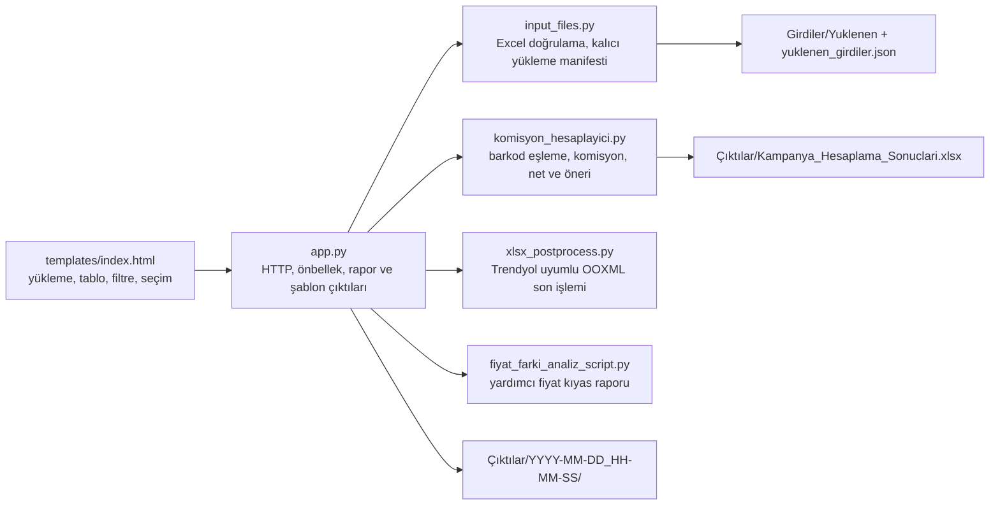

# Kampanya hesaplayıcı: mimari ve işletim

## Amaç ve kapsam

Bu uygulama Trendyol ürün, komisyon ve kampanya Excel’lerini barkod üzerinden birleştirir; her kampanyanın ürün başına bırakacağı net tutarı hesaplar; güncel netten daha iyi olan en kârlı seçeneği önerir ve kullanıcının son seçimine göre Trendyol’a geri yüklenebilir Excel dosyaları üretir.

Uygulama tek süreçli, yerel dosya sistemine dayalı bir Flask uygulamasıdır. Veritabanı, kullanıcı hesabı veya uzak nesne depolama katmanı yoktur. Bu nedenle mevcut kurulum güvenilir bir yerel ağ/masaüstü kullanımı ve tek kalıcı disk varsayımıyla çalışır.

Kesin Excel, API ve hesap sözleşmeleri için [sistem spesifikasyonuna](sistem_spesifikasyonu.md) bakın. Aynı davranışı Next.js’e taşıma görevi için [Next.js aktarım promptunu](nextjs_aktarma_promptu.md) kullanın.

## Çalıştırma

```powershell
python -m venv venv
.\venv\Scripts\Activate.ps1
python -m pip install -r requirements.txt
python -m unittest discover -s tests -v
python app.py
```

Uygulama `http://127.0.0.1:5114` adresinde çalışır. Ana bağımlılıklar Flask, pandas ve openpyxl’dır; sabit sürümler `requirements.txt` dosyasındadır.

## Bileşenler



| Parça | Sorumluluk |
| --- | --- |
| `app.py` | Sayfayı sunar; `/api/data`, `/api/calculate`, `/api/apply` ve indirme uçlarını yönetir; rapor satırlarını oluşturur; kampanya şablonlarını filtreleyip kaydeder. |
| `input_files.py` | Girdi türlerinin zorunlu sütunlarını tanımlar; XLSX/ZIP güvenlik kontrollerini yapar; yüklemeleri sabit iç adlarla saklar; özgün ad ve yükleme tarihini manifestte tutar. |
| `komisyon_hesaplayici.py` | Ürün evrenini çıkarır, barkod eşleştirir, fiyat/komisyon/net değerlerini hesaplar ve öneriyi seçer. |
| `templates/index.html` | Jinja ile üretilen tek sayfa arayüzüdür. DataTables tablosunu, filtreleri, görünür sütunları, ürün bazlı ve toplu seçimleri yönetir. |
| `xlsx_postprocess.py` | Üretilen dosyalardaki inline string hücrelerini shared strings yapısına dönüştürür, bilinen formüllerin önbellek değerlerini düzeltir ve Trendyol okuyucusuyla uyumluluğu artırır. |
| `fiyat_farki_analiz_script.py` | Uygulanmayan ürünler ile indirim listesini karşılaştıran yardımcı raporu üretir. Ana hesap motorunun parçası değildir. |
| `tests/` | Girdi tanıma/kalıcılık, öneri, Plus Ek İndirim, karşılamalı kampanya, seçim güvenliği, rapor sırası ve arayüz sözleşmelerini doğrular. |

`temp_script_3.js`, `temp_script_clean.js` ve `prompt.txt` çalışan uygulama tarafından içe aktarılmaz; bunlar geliştirme geçmişi/ara çalışma kalıntılarıdır. `Girdiler/karsilamali_config.json` da güncel çoklu karşılamalı kampanya akışının kaynak dosyası değildir.

## Uçtan uca akış

### 1. Sayfanın açılması

1. `GET /`, girdi kataloğunu ve manifestteki son yükleme durumlarını Jinja şablonuna verir.
2. Tarayıcı `GET /api/data` çağırır.
3. Hesap sonucu yoksa veya manifest hesap sonucundan yeniyse API `needs_calculation` döndürür.
4. Güncel bir sonuç varsa satırlar Excel önbelleğinden okunur; Excel’e metin olarak yazılmış `eligible_campaigns` listeleri ve `counter_evaluations` sözlükleri güvenli biçimde geri yüklenir.

### 2. Girdilerin yüklenmesi ve hesaplama

1. Kullanıcı üç zorunlu girdi alanını sağlar veya daha önce yüklenmiş kalıcı kopyaları kullanır.
2. Yalnızca yeni seçilen standart dosyalar değiştirilir; diğer kalıcı girdiler korunur.
3. Standart girdinin özgün dosya adı karar mekanizmasına girmez. Girdi türü seçilen yükleme alanıyla belirlenir, dosya o türe ait zorunlu sütunlarla doğrulanır ve sabit iç adla saklanır. Böylece “Güncel ürünler” dosyasında ad kuralı yoktur.
4. Çoklu karşılamalı kampanya dosyaları ve düzenlenebilir eşik/indirim/Trendyol karşılama değerleri ayrıca alınır.
5. Hesap motoru indirim listesi ile güncel ürün listesinin barkod birleşimini işler.
6. Sonuç `Çıktılar/Kampanya_Hesaplama_Sonuclari.xlsx` dosyasına yazılır. Bu dosya yeniden hesaplama önbelleğidir; son kullanıcı raporu değildir.

### 3. Öneri ve kullanıcı seçimi

- Her ürün için kampanya fiyatı, komisyon oranı ve kalan net hesaplanır.
- İndirim veya muhasebe girdisinden gerçek bir dip fiyat varsa hiçbir kampanya son fiyatı bu dip değerin altına inemez. Dip fiyat girilmemiş üründe kampanya dosyasındaki pozitif fiyat doğrudan adaydır.
- Kampanya satırında fiyat boşsa güncel fiyat kampanya fiyatı olarak denenir; bu fallback aday yalnız kampanya neti güncel netten yüksekse uygulanabilir olur.
- Girilmiş fiyatlı uygulanabilir kampanyalar ile kârlı fallback adayları arasındaki en yüksek netli seçenek `İlk Kampanya Seçimi` olur. Girilmiş fiyatlı adayın netinin güncel netten düşük olması seçimi tek başına engellemez.
- “Önerilenleri Seç” düğmesi her satırı yeniden bu başlangıç önerisine getirir.
- Ürün bazlı açılır liste, seçili satırlara toplu kampanya atama ve seçimleri temizleme işlemleri tarayıcı belleğinde yapılır.
- `/api/apply`, istemciden gelen seçime güvenmez; seçimi sunucunun hesapladığı uygulanabilir kampanya gruplarıyla tekrar doğrular.

Özel kural motoru yalnızca o anda `Hiçbiri` olan satırlara ve Avantajlı/Flaş karşılaştırmalarına uygulanır. Kurallar kaydedilmez; sayfa yenilenince kaybolur.

### 4. Excel üretimi

Kullanıcı `Hepsi` veya tek bir kampanya çıktı türü seçer. Sunucu her işlem için `Çıktılar/YYYY-MM-DD_HH-MM-SS` klasörü oluşturur:

- ilgili kampanya şablonunda yalnızca o kampanyaya seçilen barkodları bırakır;
- gerekli fiyat/seçim hücrelerini doldurur;
- veri doğrulama aralıklarını kalan satırlara daraltır;
- formül satır referanslarını günceller;
- dosyayı OOXML shared strings uyumluluk işleminden geçirir;
- genel, uygulanmayan ve görünür sütunlara bağlı özet raporları ekler.

`Kampanya_Ozet_Raporu.xlsx`, sayfadaki görünür rapor sütunlarının kesişimini kullanır. İstemci hangi sırada gönderirse göndersin sütunlar sunucudaki kanonik sırada üretilir. Seçim kutusu sütunu Excel’e yazılmaz.

## Arayüz davranışı

Arayüz CDN üzerinden Tailwind CSS, DaisyUI, jQuery ve DataTables kullanır. Varsayılan sayfa boyutu 50 satırdır.

Mevcut filtre ve kontroller:

- genel metin araması;
- sayfa boyutu ve sayfalama;
- yalnızca indirim uygulanabilecek ürünleri gösterme;
- `Uygulanan Kampanya` ve `Hangisi Karlı?` sütun filtreleri;
- filtreleri temizleme;
- tüm rapor sütunlarını ayrı ayrı gösterme/gizleme;
- satır seçimi ve toplu kampanya atama;
- önerileri seçme ve seçimleri temizleme;
- Avantajlı/Flaş için isteğe bağlı dinamik kurallar.

Varsayılan olarak gizlenen sütunlar:

- Güncel Fiyat, Güncel Net, Güncel Komisyon;
- Avantajlı Fiyat/Net;
- Flaş Fiyat/Net;
- Plus Fiyat/Net;
- Plus Ek İndirim Fiyat/Net;
- Uygulanan Kampanya Fiyat/Net/Komisyon.

Diğer rapor sütunları ilk açılışta görünürdür.

## Kalıcılık ve dosya yerleşimi

```text
Girdiler/
├── Yuklenen/                         # Çalışma zamanı standart girdileri (git dışında)
│   ├── discount.xlsx
│   ├── commission.xlsx
│   ├── current.xlsx
│   └── ... opsiyonel sabit adlar
├── Yuklenen/counter_files/           # Çoklu karşılamalı kampanya kopyaları
├── yuklenen_girdiler.json            # Özgün ad, zaman, iç ad ve counter_configs
├── muhasebe/                         # Depoda örnek/referans Excel’leri
└── *.xlsx                            # Depoda örnek/referans Excel’leri

Çıktılar/
├── Kampanya_Hesaplama_Sonuclari.xlsx # Son hesap önbelleği
└── YYYY-MM-DD_HH-MM-SS/              # Her uygulama çalışmasının teslim dosyaları
```

Standart yüklemeler yenisi gelene kadar kalır ve arayüzde özgün dosya adı ile yükleme tarihi gösterilir. Depodaki `Girdiler/*.xlsx`, `Girdiler/muhasebe/*.xlsx`, `girdieski/` ve `trendyol_excel/` dosyaları örnek/referans veridir; ana hesaplama bunları otomatik keşfetmez. Ana hesaplama yalnızca manifestteki `Girdiler/Yuklenen` kopyalarını kullanır.

Son hesap dosyasının değiştirilme zamanı manifestten eskiyse sonuç geçersiz sayılır. Yeni bir girdi yükledikten sonra yeniden hesaplama zorunludur.

## Güvenlik ve dağıtım sınırı

- Standart yüklemeler yalnızca `.xlsx` kabul eder; dosya boyutu, ZIP imzası, ZIP girdisi sayısı, açılmış toplam boyut ve zorunlu başlıklar kontrol edilir.
- Özgün dosya adı disk yolu olarak kullanılmaz; sabit iç adlar ve kök dizin kontrolü yol geçişini engeller.
- İndirme uç noktası yalnızca zaman damgası biçimindeki çıktı klasörlerine izin verir.
- Sunucuda kimlik doğrulama, yetkilendirme, CSRF koruması ve kullanıcı izolasyonu yoktur. Bu sürüm güvenilmeyen ağa doğrudan açılmamalıdır.
- Yerel disk ve tek manifest tüm kullanıcılar için ortaktır. Çok kullanıcılı veya çok örnekli dağıtımda yarış durumu ve veri karışması oluşabilir.

## Bilinen sınırlar ve teknik borç

Bu bölüm hedef davranış değil, 5 Ağustos 2026 tarihindeki gerçek çalışma durumudur:

1. Çoklu karşılamalı kampanya dosyaları manifestte saklansa da sayfa yenilenince kartlar ve düzenlenmiş parametreler tarayıcıya geri yüklenmez. Boş bir sonraki hesaplama isteği kayıtlı `counter_configs` listesini silebilir.
2. Yalnızca `Karşılamalı Kampanya` çıktı türü istendiğinde sunucu, standart girdi kataloğunda bulunmayan eski `counter` anahtarını kontrol eder ve yüklü çoklu counter dosyaları olsa bile “girdi yüklenmedi” hatası verebilir. `Hepsi` akışındaki çoklu üretim manifesti kullanır. Eski kontrol geçilse bile tek-tür dalındaki `Karşılamalı` önek kontrolü farklı counter etiketlerinin satırlarını birbirinden kesin ayırmaz.
3. Çoklu counter yüklemeleri standart girdilerin XLSX/ZIP/boyut/başlık doğrulama hattından geçmez.
4. Arayüz açılır listesi `eligible_campaigns` alanını, sunucu uygulama doğrulaması ise daha dar `Uygulanabilir Kampanyalar` alanını kullanır. Dip fiyat veya komisyon kontrolünü geçmeyen bir seçenek arayüzde görünüp dışa aktarımda reddedilebilir. Özel kural motoru da bu dar listeyi önceden doğrulamaz.
5. `Indirim_Uygulanmayan_Fiyat_Kiyas_Raporu.xlsx` yardımcısı kalıcı `discount.xlsx` yerine `Girdiler` kökündeki adı “ndirim” içeren ilk örnek dosyayı arar. Bu rapor, yeni yüklenen indirim girdisiyle farklılaşabilir. Yardımcı hata fırlatmadan dosya üretmeden dönerse yanıtın `generated_files` listesi yine bu dosya adını içerebilir.
6. Çıktı klasörleri için otomatik saklama/temizleme politikası yoktur; disk kullanımı zamanla büyür.
7. `app.py` doğrudan çalıştırıldığında Flask geliştirme sunucusu `debug=True` ile açılır. Üretim sunucusu ve güvenlik katmanı ayrıca kurulmalıdır.
8. Arayüz Tailwind CSS, DaisyUI, jQuery, DataTables ve Türkçe DataTables çevirisini CDN’den alır. İnternet erişimi yoksa temel HTML açılır ancak tablo görünümü ve etkileşimleri eksilebilir.
9. Plus Ek seçili olmayan satırda sayfadaki iki Plus Ek sütunu `%5` önizlemesini gösterir; sunucunun ürettiği `Kampanya_Ozet_Raporu.xlsx` aynı hücreleri boş bırakır. Bu iki görünüm mevcut sürümde birebir değildir.

Next.js aktarımında bu maddeler uyumluluk gereği kopyalanmamalı; [aktarım promptundaki](nextjs_aktarma_promptu.md) kabul ölçütleriyle kapatılmalıdır.
